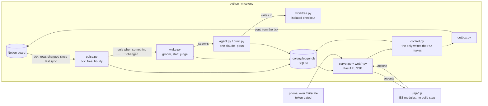

# Colony Dash architecture

One page. The full design, section by section, is `docs/design.md`; when a code
comment says §4.2 or §8.3, it means a section there.

The PO owns the backlog in Notion. Ordis is an hourly loop that grooms stories,
staffs them from a 270-persona roster, dispatches one-shot `claude -p` agents and
escalates what needs a human. Every fact about execution lives in a SQLite ledger,
so the loop resumes from disk after a crash and the dashboard is a view over that
file.

## The loop

| Tier | Runs | Costs |
| --- | --- | --- |
| Tick (`pulse.py`) | every hour, from a scheduled task | zero tokens: Notion reads, finished runs, a usage sample, a `pulses` row |
| Wake (`wake.py`) | only when the tick found a change or a PO decision | budgeted tokens; checked before every step |

A wake is idempotent. If it dies halfway, the next tick picks up from ledger state.

## Where state lives

- **The ledger** (`colony/db.py`, `colony/migrations/*.sql`, append-only). Stories,
  tickets, runs, pulses, escalations, skills, the roster, the console session.
- **Notion** holds intent. The colony reads it and writes back only through the
  outbox, which the tick flushes outside the pulse transaction.
- **The browser** keeps view preferences (theme, folded panels) and nothing else.

## Safety

Three gates stay human: the PO marks a story ready, approves any patch before it
touches the live tree, and approves a skill before the colony uses it. Agents
read the whole projects root and write only in a worktree of the ticket's own
project. `.env`, `.git/` internals, push, amend and force-push are off limits at
every tier. The console is the one exception, a real shell that answers only
from this machine unless the PO opens it from the desk. `docs/design.md` §8 has
the details.

## Code map

| Area | Files |
| --- | --- |
| Loop | `pulse.py`, `wake.py`, `agent.py`, `build.py`, `runner.py`, `forge.py` |
| Isolation | `worktree.py`, `secretfiles.py`, `proc.py` |
| Intake | `notion.py`, `outbox.py`, `projects.py`, `roster.py` |
| PO actions | `control.py`, `wording.py` (long copy), `attachments.py` |
| Server | `server.py` mounts `web/state.py`, `stories.py`, `reads.py`, `controls.py`, `roster.py`, `console.py`, `phone.py`, `pages.py` |
| Page | `ui/index.html`; `ui/js/main.js` boots, `render.js` redraws only the panels whose slice changed, `core.js` holds the DOM builders |
| Phone | `access.py`, `phone.py`, `net.py`, `tailscale.py`, `qr.py` |
| Desktop | `desktop.py` (pywebview), `autostart.py`, `schedule.py`, `shortcut.py` |

History lives in `docs/history/`: the dated project journal and the build log
for milestones M0 to M5 and after.
