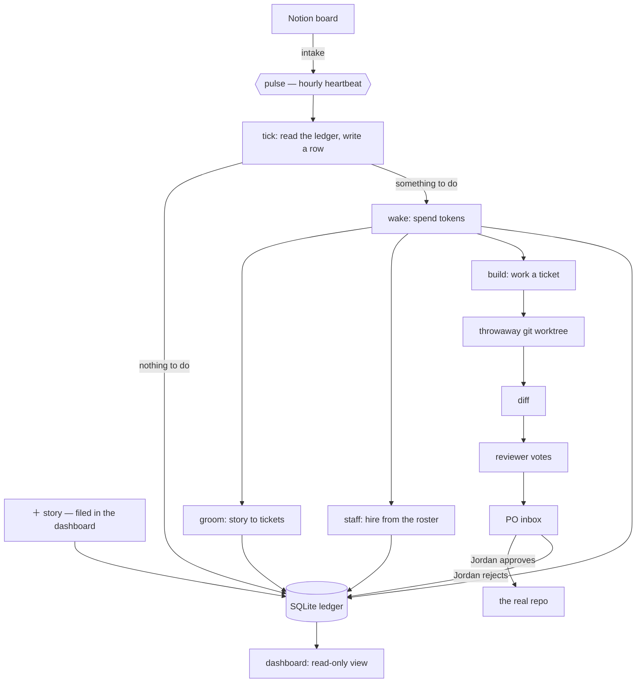

# Colony Dash

An autonomous agent colony that runs a scrum board against a directory of real
projects — and a dashboard to watch it spend your money.

A heartbeat wakes once an hour, reads the board, breaks stories into tickets,
hires specialist agents to work them, spends a bounded token budget, and
escalates only what genuinely needs a human. Every fact about execution lives in
a SQLite ledger rather than in a context window, so the loop is resumable, the
dashboard is a plain read view, and a crashed agent costs you a run instead of a
week.

The interesting problem here is not "can an LLM write code." It is: **what does
it take to leave one running unattended and still trust the repo in the
morning?** Most of this codebase is the answer to that question.

<!-- Screenshots: drop PNGs into docs/ and uncomment.


-->

---

## How it works



Two things in that diagram carry most of the weight.

**The pulse writes a row even when nothing happened.** A "clean" tick is data. A
silent cron job is indistinguishable from a broken one, so a gap in the `pulses`
table is itself the alarm.

**Nothing reaches a real repo without a human.** Agents write into a throwaway
git worktree. The diff goes to the PO inbox with a recommendation and a cost.
The loop never merges its own work and never approves its own output.

Work arrives through two doors. Notion is the one with a workflow around it —
someone else's board, synced on every pulse. The dashboard's **＋ story** button
is the one for the thought you had at 11pm, and it writes to the ledger
directly. Neither is required; a colony with no Notion credentials configured
still has a full board.

## The ledger is the system

There is no server to be down at 3am. One SQLite file under `.colony/` holds
sprints, stories, tickets, runs, pulses, token samples, escalations, skills, and
the roster. Agents read it and write to it; they do not remember. Schema changes
are append-only migrations verified by sha256 on every startup, so a checkout at
any commit can open a ledger from any earlier one.

The dashboard opens its own read-only connection. WAL mode is what lets it paint
while the pulse writes.

## The safety model

This is the part worth reading if you're only reading one.

Agents get a tool **denylist that cannot be overridden by their contract**
(`colony/agent.py:37`):

```python
ALWAYS_DENIED = ["Bash", "WebFetch", "WebSearch", "Task", "KillShell", "BashOutput"]
```

`Bash` is the load-bearing entry. `Edit` and `Write` are bounded — they touch
files inside a disposable worktree. `Bash` is unbounded: it is `git push`,
`rm -rf`, `curl | sh`. Denying the shell is what makes *"the colony cannot
push"* a statement about capability rather than a promise the agents are being
asked to keep.

Write tools unlock only when two independent things are true: the contract is
write-capable, **and** the caller has already opened a worktree for the run to
write into. The flag says "this run may write"; the `cwd` says where. No
contract on its own can produce both.

Read scope is the projects directory. Write scope is one project folder, named
by the active ticket, in a worktree, after approval. Never, at any tier: `.env`
or any credential file, `.git` internals, anything outside the projects root, or
`git push` / `commit --amend` / force-push / branch deletion.

### The one deliberate exception

`colony/console.py` runs `claude` with `--dangerously-skip-permissions`, no
allowlist and no worktree. That is not an oversight, and it is not the loop.

The whole design above is right for something that wakes up on its own at 3am.
It is exactly wrong for the case where a person is sitting in front of the
dashboard wanting to change the dashboard — every such change had to go out to a
separate terminal, and a program meant to run itself could not edit itself.

So the console is a second door, deliberately unlike the first:

- **It only opens when a person types.** There is no import path from
  `pulse.py` or `wake.py` into that module, and that is enforced by keeping the
  dependency one-directional. Nothing scheduled can reach it.
- **It is one conversation at a time.** A second send while a turn is in flight
  is refused rather than queued — two shells writing one tree is the exact
  failure this system exists to prevent.
- **It bills itself out loud.** Every turn's tokens and cost land in
  `console_turns`. Clearing the chat starts a new epoch instead of deleting
  rows, so the spend history survives the clear.

The guards that stay are the ones that were never about the agent: the server
binds `127.0.0.1` unless told otherwise, and every `/api/console/*` call needs
the `X-Colony` header like all other write routes.

Worth being exact about that header, because it is easy to read as more than it
is. It is CSRF protection — it proves a call came from the dashboard's own page
rather than from a link someone clicked. The *access* control was the loopback
bind. So the moment `--host` points anywhere else, the header is no longer
enough on its own, which is why serving off-machine is what arms the token gate
(`access.py`) rather than something you can forget to turn on.

## Budget

Tokens are the unit, dollars are grayed out beside them. A sprint gets an
allowance expressed as a percentage of the weekly window, the pulse samples
usage on the way past, and dispatch stops when the allowance is gone rather than
when the bill arrives. The two-tier pulse exists for the same reason: a tick is
free, a wake is not, and most hours only need a tick.

---

## Running it

Needs the `claude` CLI on your `PATH` and already authenticated. Developed and
run on Python 3.12.

```bash
git clone <this repo>
cd colony-dash
py -m pip install -r requirements.txt

cp .env.example .env      # optional — every key in it is optional
py -m colony init         # ledger, migrations, the two structural agents
py -m colony dash         # the dashboard window
```

`init` also scans `~/.agency-agents` for the persona roster if you have it
installed, and says "roster skipped" if you don't. The colony runs either way —
without a roster it just cannot hire beyond the two structural agents.

`colony dash --serve` skips the desktop window and just serves, if you'd rather
use a browser at `127.0.0.1:8787`.

The colony watches the folder **containing** this checkout, which assumes a
layout like:

```
projects/
  colony-dash/      <- this repo
  some-other-app/
  another-thing/
```

Point it somewhere else with `COLONY_PROJECTS_ROOT` in `.env` or the
environment.

### From a phone

The dashboard is responsive and installable — add it to a home screen and it
launches without browser chrome, in its own window, on its own icon. That is a
manifest and a service worker, not a second application: the phone renders the
same page against the same server against the same ledger, so there is no sync
step and nothing to reconcile. The service worker deliberately caches nothing
but an offline notice, because a cached board is yesterday's board displayed
with today's confidence.

Reaching it means serving on something other than loopback, which requires a
token — and that is one button. In the dashboard, open **file → phone** and
press *turn on*: it mints the token, writes it to `.env`, registers the logon
task, starts it, and shows you a QR code to point a camera at.

The same thing from a terminal, if you prefer:

```bash
py -m colony phone --on      # set it up and print the QR code
py -m colony phone           # where it is and whether it is answering
py -m colony phone --off     # stop serving at logon
```

Scanning the code opens `http://<address>:8787/?k=<token>` on the phone once.
The token is swapped for a 90-day cookie and stripped from the address bar,
because a token in a URL is a token in the browser history.

Turning it on never overwrites a `COLONY_ACCESS_TOKEN` that is already set, and
turning it off leaves the token alone — a phone that is paired stays paired.
The write to `.env` is an append and touches no existing line.

`autostart` registers a hidden scheduled task — the same shape as the hourly
pulse, and beside it — so the server is already up when you pick up your phone.
That is the difference between a feature and a demo: the phone is the device you
use *because* you are not at the desk, and "first go to the desk and start it"
cancels the whole thing out. It binds `--host auto`, resolved at every launch
rather than written into the task once, because an address is a fact about the
network at boot and a task holding a stale one fails silently on the day it
changes. A tailnet address wins; a private LAN address is the fallback and says
so; anything else refuses.

| Command | What it does |
| --- | --- |
| `py -m colony phone --on` | the whole setup, and a QR code |
| `py -m colony autostart` | install it and start it now |
| `py -m colony autostart --show` | what is registered, and what is answering |
| `py -m colony autostart --remove` | stop it starting by itself; on-demand still works |

For one session instead of forever, `py -m colony dash --host auto --serve` is
the same bind without the task.

`--host` on a non-loopback address **refuses to start** without
`COLONY_ACCESS_TOKEN` set. That is not a nag: the dashboard is the whole ledger,
every run transcript, the project tree, and a button that spends money. Serve it
on a tailnet (Tailscale, WireGuard) rather than `0.0.0.0` and a forwarded router
port — the token is meant to be the second lock, not the only one.

This is remote access, not accounts. One operator, one ledger, one machine's
filesystem. See ARCHITECTURE.md §10.19 for why multi-tenancy is a different
program rather than a later feature.

### The rest of the CLI

| Command | What it does |
| --- | --- |
| `py -m colony status` | the dashboard, in text |
| `py -m colony pulse` | run one pulse now; `--no-wake` guarantees zero tokens |
| `py -m colony pulse --dry-run` | report what it would do, write nothing |
| `py -m colony halt` / `resume` | stop or restart all dispatch, colony-wide |
| `py -m colony allowance 10` | move this sprint's budget, signed percentage points |
| `py -m colony agents` | who is on the books and what they may touch |
| `py -m colony roster <query>` | search the hiring pool |
| `py -m colony projects --diff X` | what has moved on disk |
| `py -m colony sql "SELECT ..."` | read the ledger directly |
| `py -m colony schedule` | install the hourly pulse as a hidden task |
| `py -m colony shortcut` | build the icon and a Desktop shortcut |
| `py -m colony mirror` | full refresh of the MySQL reporting mirror |

`halt` writes both a `.colony/HALT` file and a ledger row, on purpose: the one
control that must never fail open is the stop switch.

### Tests

```bash
py -m unittest discover -s tests -v
```

Standard-library `unittest`, no install step — a suite that needs a dependency
before it runs is a suite nobody clones and runs. 96 tests, under three seconds,
and they cover the things that are claims rather than code: migrations apply in
order and refuse to be edited afterwards, the tool denylist survives a contract
that asks for `Bash`, the write scope refuses everything outside one named
project folder, a story filed in the dashboard cannot name a folder that does
not exist, and the server cannot reach `uvicorn.run` on a network address with
no token configured, `--host auto` never resolves to a public address, and a
dashboard already serving on the network is not raised a second time on
loopback. The console's one-turn-at-a-time lock is in there too,
intercepted rather than spawned — nothing in the suite launches `claude`, and
nothing touches the real ledger.

### Platform

Developed and run on Windows 11. The core — ledger, pulse, agents, worktrees,
server — is portable, and the dashboard is a local web app. Two commands are
Windows-only by construction: `schedule` and `autostart` install hidden Task
Scheduler entries that run under `pythonw.exe` (a background heartbeat that pops
a console window once an hour is not a background heartbeat), and `shortcut`
writes a Desktop `.lnk`. On another OS, run the pulse from cron, the server from
a systemd user unit or a launch agent, and skip all three. `net.py` is portable;
it reads addresses, not the registry.

---

## Layout

```
colony/
  db.py           the ledger: connection, pragmas, sha256-verified migrations
  pulse.py        the heartbeat — tick, and when to escalate to a wake
  wake.py         the expensive half: groom, staff, reply, forge
  build.py        a build agent, worktree in and diff out
  agent.py        the one place an agent is spawned, and the tool denylist
  worktree.py     disposable checkouts
  control.py      halt, allowance, approvals, scope — the PO's levers
  server.py       FastAPI, loopback by default
  access.py       the gate that arms when the bind stops being loopback
  net.py          which address on this machine a phone can actually reach
  autostart.py    the server as a logon task, so the phone finds it already up
  phone.py        that whole setup as one switch, on the page and in the CLI
  qr.py           a QR encoder, so the address is something you scan
  console.py      the PO's terminal (see: the deliberate exception)
  notion.py       intake
  roster.py       the hiring pool, scanned from an agency-agents install
  forge.py        mining finished work for repeatable procedure
  mirror.py       one-way SQLite -> MySQL, for reporting
  migrations/     append-only schema history
  ui/             index.html, app.css, app.js — no build step
                  manifest.webmanifest, sw.js, icons — installable on a phone
tests/            stdlib unittest, no install step
```

## Further reading

`ARCHITECTURE.md` is the real design document — the state model, the pulse
tick-by-tick, the budget rules, the execution model, section by section. Start
at §0 for the one-paragraph version.

`ROSTER.md` covers the hiring pool and why a persona alone is useless without
governance attached to it.

`PROJECT.md` is a working journal, not documentation. It is a dated log of what
was built and what broke, kept in the repo because the reasoning behind a
decision is worth more later than the decision is. Read it if you want the
archaeology; skip it otherwise.

## Status

Personal project, actively used, one operator. It is not a product: there is no
multi-tenancy, auth is a single shared token over a private network, and the
test suite covers the safety model rather than the whole surface. What it is
instead is a real
answer to the question at the top — a loop that has been left running against
live repos without eating one.
