# Colony Dash

A team of Claude agents that works a scrum board against a folder of real
projects, and a dashboard that shows what they did and what it cost.

Once an hour a heartbeat reads the board. It breaks stories into tickets, hires
agents to work them, spends from a fixed token budget, and escalates only what a
person has to decide. Every fact about a run lives in a SQLite file rather than
in a context window. The loop survives a restart, the dashboard is a plain read
view of that file, and a crashed agent costs one run.

Getting a model to write code is the easy half. The hard half is leaving one
running overnight and still trusting the repo in the morning. Most of this
codebase is the answer to that.

<p align="center">
  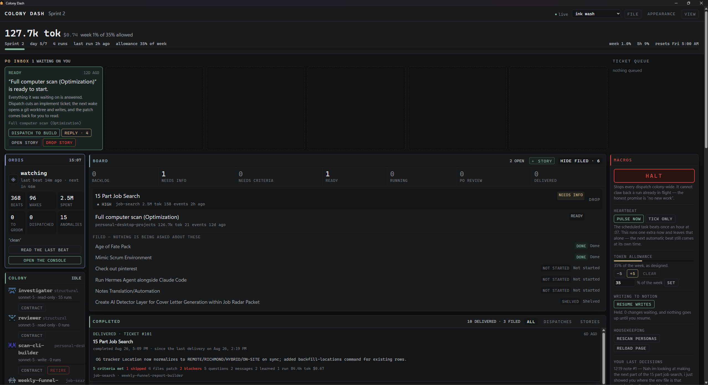
</p>

<p align="center"><em>One window. Spend across the top, what needs a human under
it, the board in the middle, the colony down the left, the levers on the
right.</em></p>

**Contents** &middot; [How it works](#how-it-works) &middot;
[The dashboard](#the-dashboard-panel-by-panel) &middot;
[Where the agents come from](#where-the-agents-come-from) &middot;
[The ledger](#the-ledger-is-the-system) &middot;
[Safety](#the-safety-model) &middot;
[Budget](#budget) &middot; [Running it](#running-it) &middot;
[From a phone](#from-a-phone) &middot;
[Tailscale](#tailscale-makes-it-work-off-your-wifi) &middot;
[How safe is this, honestly](#how-safe-is-this-honestly)

---

## How it works

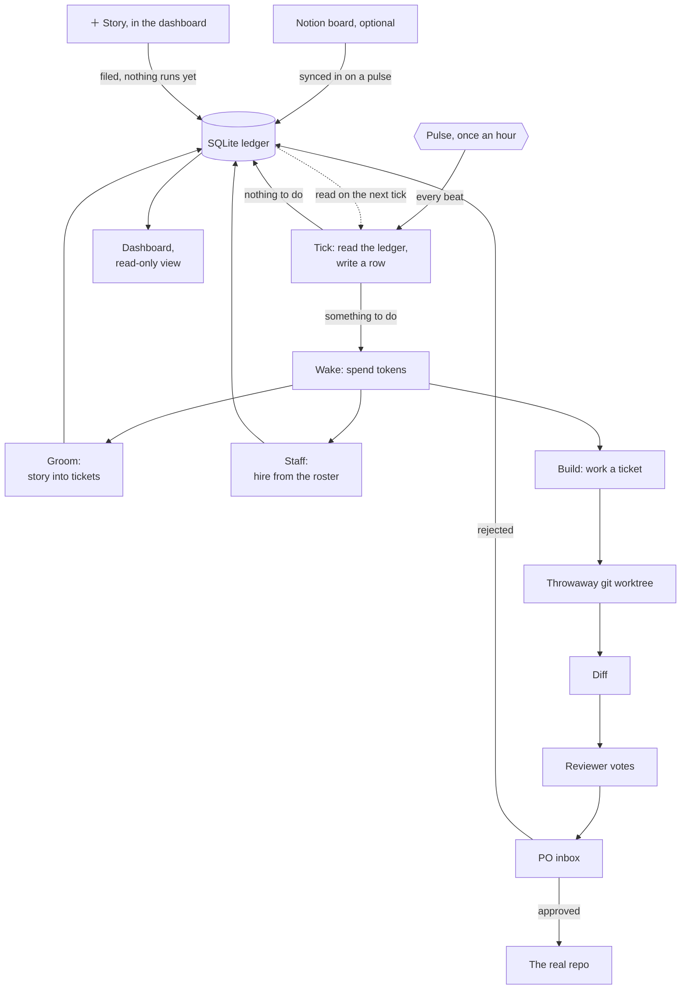

Three things in that diagram carry most of the weight.

### Filing a story costs nothing

The green **＋ Story** button on the board writes one row and stops. No agent
wakes up, no tokens move, nothing is decided. The row sits there until the next
tick reads it. That tick is the moment the colony starts having opinions about
it, so you can dump a half-formed idea in at 11pm and read what it made of the
idea in the morning.

Notion is the other way in, and it is optional. If you already keep work in a
Notion database, `colony/notion.py` syncs it on every pulse. Configure it and the
two intakes behave identically from there on. Skip it and the board is still
full.

### The pulse writes a row even when nothing happened

A clean tick is data. A silent cron job looks exactly like a broken one, so a gap
in the `pulses` table is the alarm.

<p align="center">
  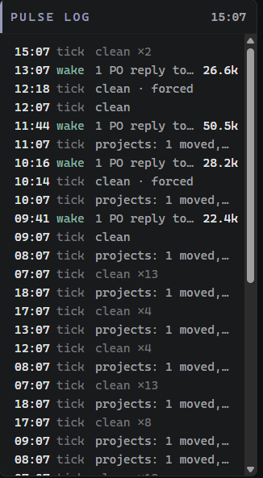
</p>

<p align="center"><em><code>clean</code> is a real result, and <code>clean x13</code>
is thirteen hours of nothing that were each checked. <code>forced</code> is a beat
someone asked for by hand, and it does not move the scheduled one. A wake carries
the tokens it cost.</em></p>

### Nothing reaches a real repo without you

Agents write into a throwaway git worktree. The diff goes to the PO inbox with a
recommendation and a cost. The loop never merges its own work and never approves
its own output.

<p align="center">
  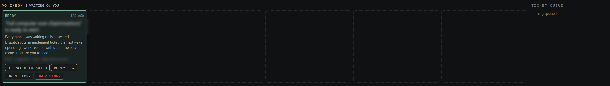
</p>

<p align="center"><em>The inbox is five slots wide and usually mostly empty. A
card here has already been triaged as something no agent may decide. The empty
slots are a ceiling: once they fill, dispatch stops adding to the pile.</em></p>

## The dashboard, panel by panel

### The board

<p align="center">
  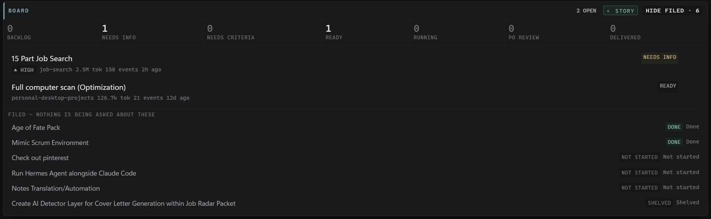
</p>

Seven lanes, and the counts are the whole summary. `needs info` and `needs
criteria` are lanes rather than error states. "The colony does not know enough to
start" is a normal condition, and it should be visible instead of retried.

**Filed** sits below the line, labelled *nothing is being asked about these*. A
story that is done, shelved or never started still belongs on the board, but
mixed in with live work it reads as backlog. Keeping it separate is what makes
the lane counts above worth trusting.

### Completed

<p align="center">
  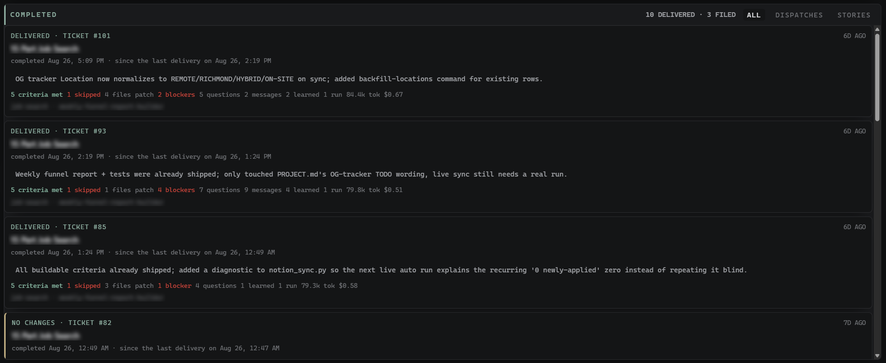
</p>

Every delivery, newest first, with what changed in one sentence and what it cost.
The counts under each one (`5 criteria met`, `1 skipped`, `2 blockers`) are the
honest version. A dispatch that met most of its criteria and hit two blockers is
reported that way rather than as a green tick. `NO CHANGES` is its own outcome,
because a run that correctly decided there was nothing to do is not a failure.

### Ordis, and the colony

<p align="center">
  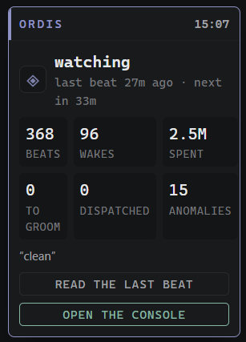
  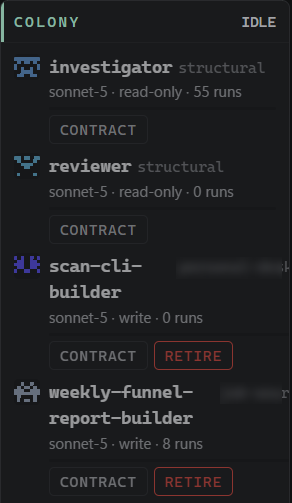
</p>

Left is the heartbeat: beats, wakes, tokens spent, time until the next one, and
the last beat's verdict in quotes. The verdict is `"clean"` far more often than
not.

Right is who is actually employed. Each agent shows its model, whether its
contract is read-only or write-capable, and how many runs it has done. `RETIRE`
ends a contract. The two structural agents have no such button, because a colony
with no investigator and no reviewer is not a colony.

### Replying to a story

<p align="center">
  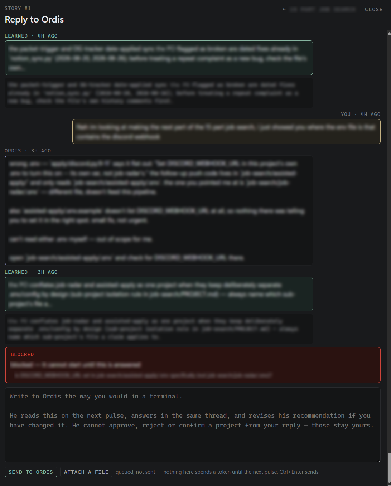
</p>

A story is a thread, not a form. Ordis asks, you answer in your own words, and
the next pulse reads the reply rather than spending a token now. The footer says
so.

`LEARNED` entries are what the colony kept from the exchange, shown with the
exact sentence it stored. A system that claims to learn should show its notes. A
red `BLOCKED` band sits in the timeline where it happened rather than at the top,
so you can see what was already understood before the question came up.

### Files

<p align="center">
  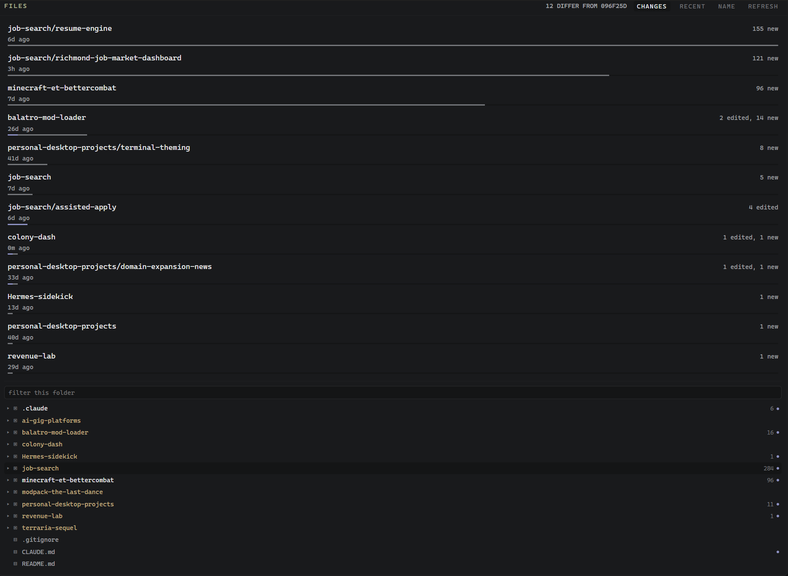
</p>

What has moved on disk since a given commit, across every project the colony can
read, ranked by how much. This is the read scope made visible. It answers "what
has been happening around here" without asking an agent. The tree below it is a
plain browser with a filter.

### Spend

<p align="center">
  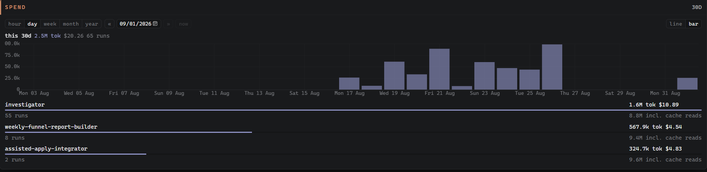
</p>

Tokens over time by hour, day, week, month or year, then the same total broken
out per agent. Cache reads are listed separately (`8.8M incl. cache reads`).
Folded into the main number, an agent looks ten times more expensive than it is,
and you act on the wrong figure.

### Macros

<p align="center">
  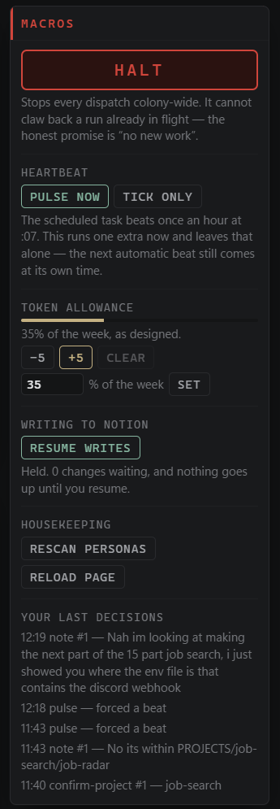
</p>

The levers, in the order you reach for them. `HALT` is first, is red, and says
what it cannot do: it stops new dispatch and cannot claw back a run already in
flight. `PULSE NOW` runs one extra beat and leaves the schedule alone. `TICK
ONLY` is the free one. The allowance moves in signed percentage points rather
than being set blind.

**Your last decisions** at the bottom is a short log of what you did. After a
week away the first question is usually not what the colony did but what you told
it.

### The forge

<p align="center">
  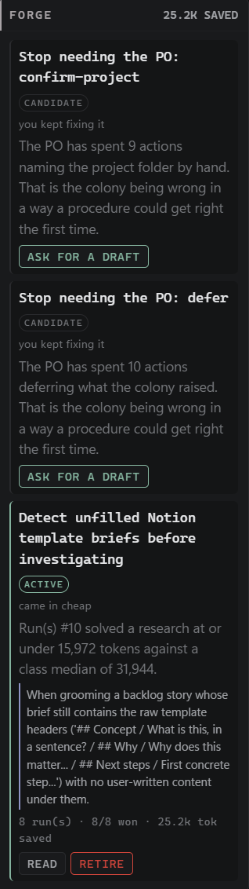
</p>

The forge watches finished work for repeatable procedure. When you keep
correcting the same thing by hand, nine times naming the project folder, ten
times deferring the same kind of escalation, that is the colony being wrong in a
way a written procedure could get right the first time. A candidate can become a
skill. An `ACTIVE` one carries its evidence (`8 run(s) - 8/8 won - 25.2k tok
saved`) and can be retired the moment it stops paying.

### Themes

<p align="center">
  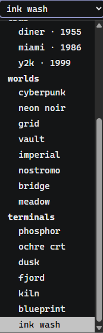
</p>

Twenty-odd of them, grouped. Cosmetic and indefensible, except that this is a
window someone looks at every day.

<details>
<summary>The whole page, top to bottom</summary>

<p align="center">
  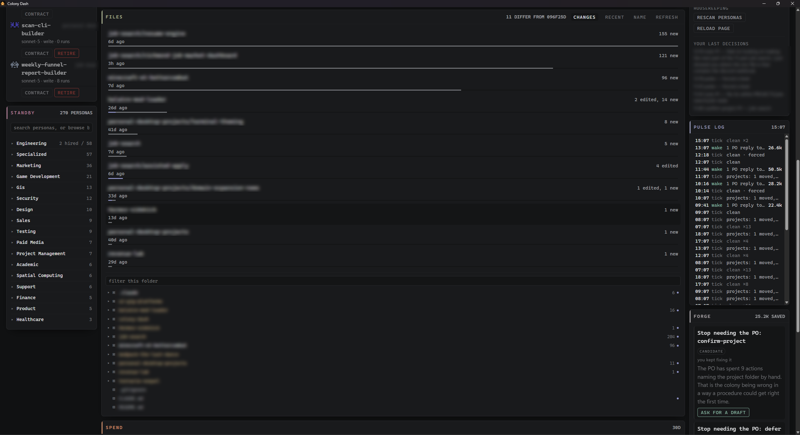
</p>

<p align="center">
  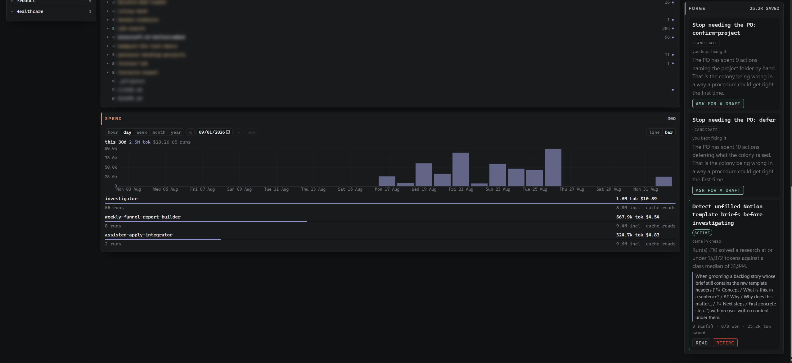
</p>

</details>

## Where the agents come from

Colony Dash does not invent its colonists. It hires them from persona files on
disk, then writes the employment contract itself.

It scans two folders, and **neither ships with this repository**:

| Folder | What it is |
| --- | --- |
| `~/.agency-agents` | an optional clone of a persona library, for example [msitarzewski/agency-agents](https://github.com/msitarzewski/agency-agents) |
| `~/.colony-agents` | personas you add yourself |

Both are optional. A fresh clone with neither has an empty Standby panel, and
everything else works.

<p align="center">
  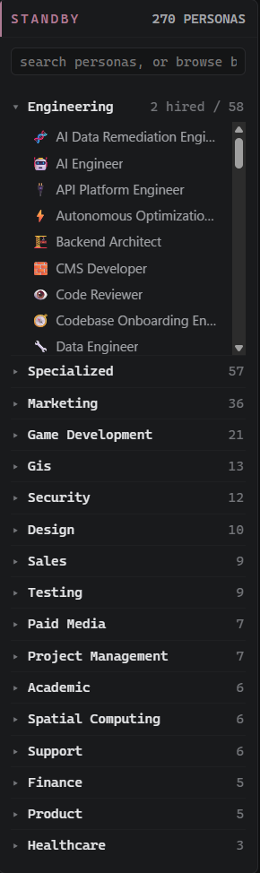
</p>

<p align="center"><em>This example workflow shows 270 personas (agents), grouped
by department, `2 hired / 58` in Engineering. Standby is a hiring pool, not a
roster. Nothing in it costs anything or has any authority until a contract is
written for it.</em></p>

The split between the two folders is the whole design. The first is somebody
else's git clone, so nothing here ever writes to it. Writing there would either
clobber a file on the next `git pull` or make that pull refuse to fast-forward.
Everything the dashboard creates lands in the second folder, which upstream has
never heard of. A local persona shadows an agency one with the same
`division/filename`, which is the supported way to override one without touching
the clone.

Neither folder is committed here. A persona library is a machine's furniture, not
this project's source, and shipping a stranger's agent library inside a repo that
merely reads it would be redistributing their work.

**Standby → `＋ persona`** opens a side panel with two ways in that meet at one
form. Drop a `.md` file and its frontmatter fills the fields, or type them. The
division is a combo box: pick a department that exists or type a new one, and it
becomes a folder. **`rescan`** beside it re-reads both folders, for a file you
added in an editor or a clone you just pulled.

<p align="center">
  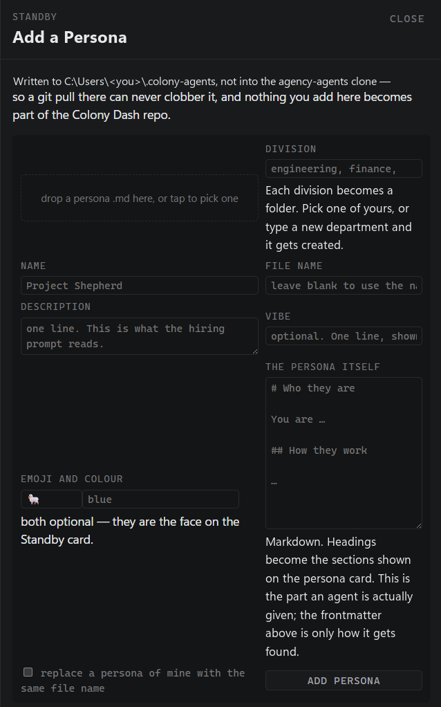
</p>

<p align="center"><em>The first sentence says where the file is going and why.
"Which of those two folders did that just write to" is the question this design
exists to answer.</em></p>

A persona file is a résumé and nothing more: `name`, `description`, `color`,
`emoji`, `vibe`. No `tools:`, no `model:`. The panel rebuilds the frontmatter
from the fields rather than passing it through, so a file arriving with a
`tools:` key loses it on the way in. A persona document that claims access it
does not have is one a person eventually believes. Everything that governs an
agent, meaning write scope, tool allowlist, token ceiling and the three gates, is
written by the contract. See ROSTER.md.

## The ledger is the system

There is no server to be down at 3am. One SQLite file under `.colony/` holds
sprints, stories, tickets, runs, pulses, token samples, escalations, skills and
the roster. Agents read it and write to it. They do not remember. Schema changes
are append-only migrations verified by sha256 on every startup, so a checkout at
any commit can open a ledger from an earlier one.

The dashboard opens its own read-only connection. WAL mode is what lets it paint
while the pulse writes.

## The safety model

This is the part worth reading if you only read one.

Agents get a tool denylist their contract cannot override (`colony/agent.py:37`):

```python
ALWAYS_DENIED = ["Bash", "WebFetch", "WebSearch", "Task", "KillShell", "BashOutput"]
```

`Bash` is the load-bearing entry. `Edit` and `Write` are bounded, because they
touch files inside a disposable worktree. `Bash` is not: it is `git push`, `rm
-rf`, `curl | sh`. Denying the shell is what makes "the colony cannot push" a
fact about capability rather than a promise the agents are asked to keep.

Write tools unlock only when two independent things are true. The contract is
write-capable, and the caller has already opened a worktree for the run to write
into. The flag says this run may write. The `cwd` says where. No contract on its
own produces both.

Read scope is the projects folder. Write scope is one project folder, named by
the active ticket, in a worktree, after approval. Never, at any tier: `.env` or
any credential file, `.git` internals, anything outside the projects root, or
`git push`, `commit --amend`, force-push, branch deletion.

### The one deliberate exception

`colony/console.py` runs `claude` with `--dangerously-skip-permissions`, no
allowlist and no worktree. That is not an oversight, and it is not the loop.

Everything above is right for something that wakes up on its own at 3am. It is
exactly wrong when a person is sitting in front of the dashboard wanting to
change the dashboard. Every such change had to go out to a separate terminal, and
a program meant to run itself could not edit itself.

So the console is a second door, built to be unlike the first:

- **It only opens when a person types.** There is no import path from `pulse.py`
  or `wake.py` into that module, and the dependency direction enforces it.
  Nothing scheduled can reach it.
- **It is one conversation at a time.** A second send while a turn is in flight
  is refused rather than queued. Two shells writing one tree is the exact failure
  this system exists to prevent.
- **It bills itself out loud.** Every turn's tokens and cost land in
  `console_turns`. Clearing the chat starts a new epoch rather than deleting
  rows, so the spend history survives the clear.
- **It only takes commands from the machine it runs on.** Reading the transcript
  works from anywhere the dashboard does. Sending does not.

That last one is the boundary that matters once the dashboard is on a phone.
Every other route here is a window onto a ledger, where a stolen access token
buys someone the board and an approve button. This one spawns a shell. The same
token would buy arbitrary code execution on the machine holding `.env`, and that
token crosses a home network over plain HTTP, first in a URL and then in a
cookie. Acceptable for a dashboard. Not for a shell.

So the console is scoped by peer address rather than by token, the same way token
rotation is, and for the same reason. Some things should not be reachable by
something that can be copied.

The console panel has a switch for it, **answer from anywhere**, next to the
message box. The switch is asymmetric on purpose:

| | from the desktop | from a phone |
|---|---|---|
| open the console to the network | yes, behind a confirm | no |
| close it again | yes | yes |

You may tighten from any device and loosen only from the machine itself. That
asymmetry is why this can be a button rather than a file edit: a switch a stolen
token could flip would not be a boundary. And the direction that stays open from
anywhere is the one you want at the moment you need it, away from the desk,
having realised the phone in your pocket can open a shell at home.

The switch writes `COLONY_CONSOLE_REMOTE` into `.env`, so the choice survives a
restart, and sets it live, so it does not need one. Editing that line by hand
still works and takes effect on the next start.

<p align="center">
  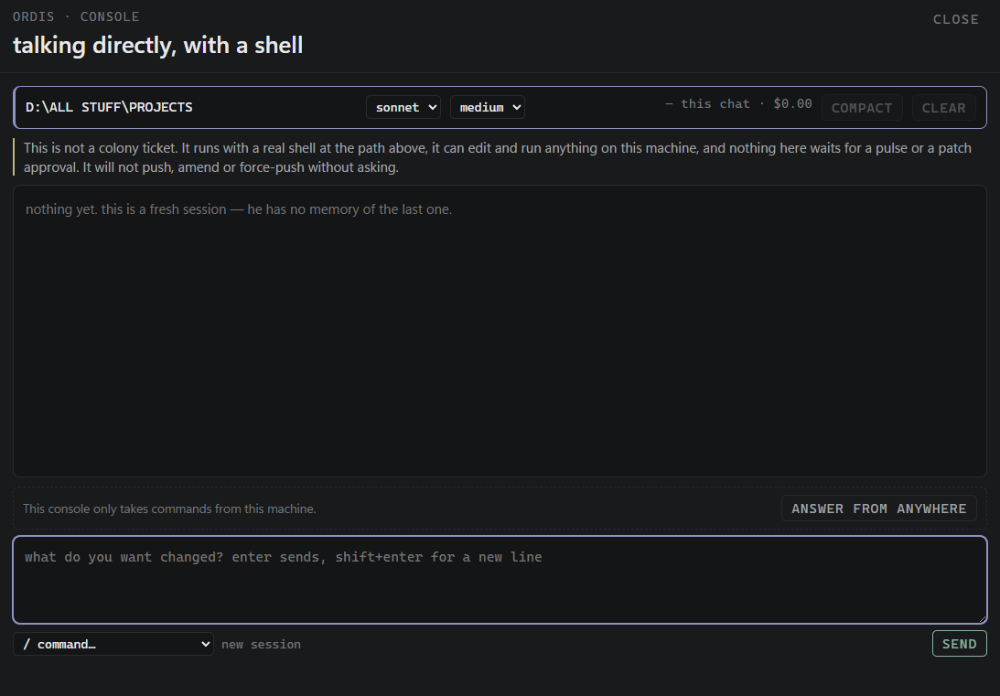
</p>

<p align="center"><em>The banner states what this is before you type in it, and
the row above the box states where it will answer from. On a phone that row
carries an explanation and, if the console is open to the network, the one button
that closes it again.</em></p>

The other guards were never about the agent. The server binds `127.0.0.1` unless
told otherwise, and every `/api/console/*` call needs the `X-Colony` header like
all other write routes.

Worth being exact about that header, because it is easy to read as more than it
is. It is CSRF protection. It proves a call came from the dashboard's own page
rather than from a link someone clicked. The access control was the loopback
bind. So the moment `--host` points anywhere else, the header is no longer enough
on its own, which is why serving off-machine arms the token gate (`access.py`)
rather than being something you can forget to turn on.

## Budget

Tokens are the unit and dollars are greyed out beside them. A sprint gets an
allowance expressed as a percentage of the weekly window. The pulse samples usage
on the way past, and dispatch stops when the allowance is gone rather than when
the bill arrives. The two-tier pulse exists for the same reason: a tick is free,
a wake is not, and most hours only need a tick.

---

## Running it

Needs the `claude` CLI on your `PATH`, already authenticated. Built and run on
Python 3.12.

```bash
git clone <this repo>
cd colony-dash
py -m pip install -r requirements.txt

cp .env.example .env      # optional, every key in it is optional
py -m colony init         # ledger, migrations, the two structural agents
py -m colony dash         # the dashboard window
```

`init` also scans `~/.agency-agents` for the persona roster if you have it, and
says "roster skipped" if you do not. The colony runs either way. Without a roster
it just cannot hire beyond the two structural agents.

`colony dash --serve` skips the desktop window and only serves, if you would
rather use a browser at `127.0.0.1:8787`.

The colony watches the folder containing this checkout, which assumes a layout
like:

```
projects/
  colony-dash/      <- this repo
  some-other-app/
  another-thing/
```

Point it somewhere else with `COLONY_PROJECTS_ROOT` in `.env` or the environment.

## From a phone

The dashboard is responsive and installable. Add it to a home screen and it
launches without browser chrome, in its own window, on its own icon. That is a
manifest and a service worker, not a second application. The phone renders the
same page against the same server against the same ledger, so there is no sync
step and nothing to reconcile. The service worker caches nothing but an offline
notice: a cached board would show yesterday's numbers as though they were now.

Reaching it means serving on something other than loopback, which requires a
token, and that is one button. Open **file → phone** and press *turn on*. It
mints the token, writes it to `.env`, registers the logon task, starts it, and
shows a QR code.

<p align="center">
  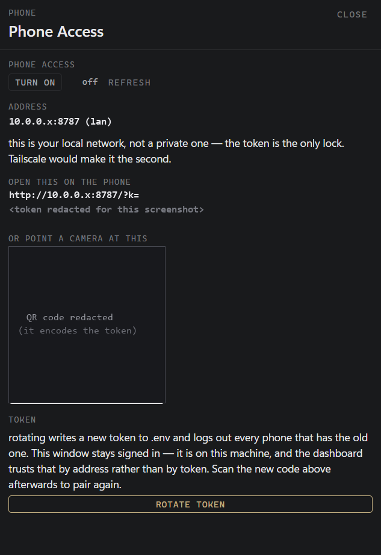
</p>

<p align="center"><em>The address, the token URL and the QR code are redacted in
this screenshot. The panel names the network it found and says what that network
can and cannot do.</em></p>

The same thing from a terminal, if you prefer:

```bash
py -m colony phone --on      # set it up and print the QR code
py -m colony phone           # where it is and whether it is answering
py -m colony phone --off     # stop serving at logon
```

Scanning the code opens `http://<address>:8787/?k=<token>` on the phone once. The
token is swapped for a 90-day cookie and stripped from the address bar, because a
token in a URL is a token in the browser history.

Turning it on never overwrites a `COLONY_ACCESS_TOKEN` that is already set, and
turning it off leaves the token alone. A phone that is paired stays paired. The
write to `.env` is an append and touches no existing line.

`autostart` registers a hidden scheduled task, the same shape as the hourly pulse
and beside it, so the server is already up when you pick up your phone. The phone
is the device you use because you are not at the desk, and "first go to the desk
and start it" cancels the whole feature out. The task binds `--host auto`,
resolved at every launch rather than written into the task once. An address is a
fact about the network at boot, and a task holding a stale one fails silently on
the day it changes. A tailnet address wins. A private LAN address is the fallback
and says so. Anything else refuses.

### Tailscale makes it work off your wifi

Without it, the dashboard binds something like `192.168.1.40`, and that address
only exists inside your building. The phone reaches it on the same wifi and
nowhere else. Not on cellular, not from work. This is the most common way phone
access disappoints: it gets set up at the desk, it works on the sofa, and it
fails in the car park with no error to explain why.

Tailscale puts this machine and your phone on one private network, so the
dashboard gets a `100.x.y.z` address that follows both devices around. `net.py`
has always preferred that address when one exists. What is new is that the panel
tells you whether one does, and offers the steps that get you there.

Open **file → phone** and read the line under the address:

| What it says | What to press |
| --- | --- |
| not installed, and an installer is in Downloads | **run the installer** |
| not installed, nothing in Downloads | a link to the download page |
| installed, not signed in | **sign in to Tailscale**, which gives you a URL and a QR code |
| connected, but the dashboard bound a local address | restart the dashboard; it came up before Tailscale did |
| connected, and the address above is the tailnet one | nothing. It works over cellular |

The sign-in step draws a QR code as well as a link, which is the convenient
accident in all of this: the phone that needs to join the tailnet can point its
camera at the screen and sign itself in.

Both buttons are offered only on the machine itself. One runs an installer with a
UAC prompt behind it, and that is not something a request arriving over the
network gets to start, however good its token is. The server enforces that as
well as the panel.

One step is yours and nothing here can do it: install the Tailscale app on the
phone and sign it in to the same account. A perfectly configured desktop and an
unconfigured phone look identical from this side.

From a terminal:

```bash
py -m colony tailscale             # installed? signed in? which address?
py -m colony tailscale --install   # run the installer from Downloads
py -m colony tailscale --login     # print the sign-in URL and a QR code
```

Tailscale is a separate product, free for personal use. There is no affiliation
here and nothing in this repo phones it.

### When the phone cannot connect

There is one step the dashboard cannot take for you. Windows Firewall needs a
rule for the port, and writing one needs administrator rights, which a web
request is never getting. If the phone loads forever rather than showing an
error, this is why: a blocked packet is dropped, not refused, so the browser
waits instead of failing. Both the panel and the CLI say so when the rule is
missing, and `py -m colony phone --allow-firewall` writes it behind one UAC
prompt. It opens one port on private networks, not the program.

The trap worth knowing: a dashboard started from a terminal runs `python.exe`,
and Windows offers to allow it the first time it binds. The logon task and the
desktop shortcut run `pythonw.exe`, which is a different file and therefore a
different rule, and a hidden task has no window to prompt in front of. So this
works when you test it from a terminal and fails on the machine you walk away
from.

If it still cannot connect, the panel answers the one question that splits the
problem in half. Under **has anything reached this** it says whether any request
from another device has arrived at all since the server started.

- **Nothing arrived.** The packets die before the server, and the cause is the
  network: the phone on a different network or on cellular, a VPN or private
  relay routing every address out to the internet, a router keeping wireless
  clients away from wired ones, or a mesh band that routes separately.
- **Something arrived and was turned away.** The network is fine and the phone is
  holding an old token. Scan the code again.

Changing the token on purpose is a separate button, *rotate token*, next to the
QR code. It writes a new value over the `COLONY_ACCESS_TOKEN=` line and leaves
every other byte of `.env` where it was, moving the file into place atomically so
a crash halfway through cannot take the Notion token with it. Every paired phone
is logged out. The desktop window is not, because a loopback caller is trusted by
address rather than by token. It is offered only on the machine itself, since
rotating from a phone would log that phone out in the middle of its own request,
and the server enforces that as well as the panel. From a terminal it is `py -m
colony phone --rotate`.

Beside the on/off switch there is a **refresh**. That panel is a snapshot of a
machine rather than of the ledger: the address after a network change, `serving`
once the logon task finally binds, the firewall after a rule is added in a
terminal, Tailscale after you install it. It is deliberately not on the live
feed, because asking Task Scheduler and PowerShell for all of that is too slow to
poll every few seconds.

| Command | What it does |
| --- | --- |
| `py -m colony phone --on` | the whole setup, and a QR code |
| `py -m colony phone --allow-firewall` | open the port, once, as administrator |
| `py -m colony phone --rotate` | a new token; every paired phone is logged out |
| `py -m colony tailscale` | installed, signed in, and which address gets bound |
| `py -m colony autostart` | install it and start it now |
| `py -m colony autostart --show` | what is registered, and what is answering |
| `py -m colony autostart --remove` | stop it starting by itself; on-demand still works |

For one session rather than forever, `py -m colony dash --host auto --serve` is
the same bind without the task.

`--host` on a non-loopback address refuses to start without
`COLONY_ACCESS_TOKEN` set. That is not a nag. The dashboard is the whole ledger,
every run transcript, the project tree, and a button that spends money.

This is remote access, not accounts. One operator, one ledger, one machine's
filesystem. ARCHITECTURE.md §10.19 covers why multi-tenancy is a different
program rather than a later feature.

### How safe is this, honestly

On a plain home LAN with no tailnet, ranked by what actually matters:

1. **The traffic is plain HTTP.** The access token rides in the first URL and
   then in a cookie, unencrypted, over your network. Anything already on that
   network, a guest, a smart TV, a compromised laptop, can read it off the wire.
   There is no defence here against an attacker who is already inside.
2. **The console is the reason that matters.** A leaked token would otherwise buy
   someone the board. The console would make it a shell. That is why the console
   answers only from the machine itself, so the worst case is a dashboard rather
   than a command prompt.
3. **The token is in the first URL**, so it lands in browser history and in any
   proxy or router log that saw it. The cookie swap covers everything after that
   first request, not the request itself. `rotate token` exists for the day you
   find it somewhere you did not expect.
4. **There is no rate limit on `/login`.** Defensible against a 256-bit token,
   since guessing is not a strategy, but worth knowing rather than assuming.

Tailscale fixes 1 and 3 outright, which is why it now has a button. Everything
above is what you get when you skip it.

What is already right, so nobody has to re-derive it: the token is
`secrets.token_urlsafe(32)` and compared with `secrets.compare_digest`, so
neither guessing nor timing gets anywhere. The cookie is `HttpOnly` and
`SameSite=Lax`, and deliberately not `Secure`, because a tailnet address is plain
`http` and `Secure` would loop the login forever. The firewall rule written by
`--allow-firewall` is scoped to private and domain networks, not public, so
joining coffee-shop wifi does not expose the port. The server binds one specific
address rather than `0.0.0.0`. And `access.check` refuses to start at all on a
non-loopback host with no token, so there is no configuration in which this
serves openly by accident.

### The rest of the CLI

| Command | What it does |
| --- | --- |
| `py -m colony status` | the dashboard, in text |
| `py -m colony pulse` | run one pulse now; `--no-wake` guarantees zero tokens |
| `py -m colony pulse --dry-run` | report what it would do, write nothing |
| `py -m colony halt` / `resume` | stop or restart all dispatch, colony-wide |
| `py -m colony allowance 10` | move this sprint's budget, signed percentage points |
| `py -m colony agents` | who is on the books and what they may touch |
| `py -m colony roster <query>` | search the hiring pool |
| `py -m colony roster --sync` | re-read both persona folders from disk |
| `py -m colony projects --diff X` | what has moved on disk |
| `py -m colony sql "SELECT ..."` | read the ledger directly |
| `py -m colony schedule` | install the hourly pulse as a hidden task |
| `py -m colony shortcut` | build the icon and a Desktop shortcut |
| `py -m colony mirror` | full refresh of the MySQL reporting mirror |

`halt` writes both a `.colony/HALT` file and a ledger row, on purpose. The one
control that must never fail open is the stop switch.

### Tests

```bash
py -m unittest discover -s tests -v
```

Standard-library `unittest`, no install step, because a suite that needs a
dependency before it runs is a suite nobody clones and runs. 200 tests, under
four seconds.

They cover the claims rather than the code. Migrations apply in order and refuse
to be edited afterwards. The tool denylist survives a contract that asks for
`Bash`. The write scope refuses everything outside one named project folder. A
story filed in the dashboard cannot name a folder that does not exist. The server
cannot reach `uvicorn.run` on a network address with no token configured. `--host
auto` never resolves to a public address. A dashboard already serving on the
network is not raised a second time on loopback. The console's one-turn-at-a-time
lock is in there too, intercepted rather than spawned. Nothing in the suite
launches `claude`, runs `tailscale`, or touches the real ledger.

### Platform

Built and run on Windows 11. The core, meaning ledger, pulse, agents, worktrees
and server, is portable, and the dashboard is a local web app. Three commands are
Windows-only by construction. `schedule` and `autostart` install hidden Task
Scheduler entries that run under `pythonw.exe`, because a background heartbeat
that pops a console window once an hour is not a background heartbeat, and
`shortcut` writes a Desktop `.lnk`. On another OS, run the pulse from cron, the
server from a systemd user unit or a launch agent, and skip all three. `net.py`
is portable: it reads addresses, not the registry. `tailscale.py` looks in
Windows install paths, but Tailscale itself runs everywhere, and `net.py` finds
its address either way.

---

## Layout

```
colony/
  db.py           the ledger: connection, pragmas, sha256-verified migrations
  pulse.py        the heartbeat: tick, and when to escalate to a wake
  wake.py         the expensive half: groom, staff, reply, forge
  build.py        a build agent, worktree in and diff out
  agent.py        the one place an agent is spawned, and the tool denylist
  worktree.py     disposable checkouts
  control.py      halt, allowance, approvals, scope: the PO's levers
  server.py       FastAPI, loopback by default
  access.py       the gate that arms when the bind stops being loopback
  net.py          which address on this machine a phone can actually reach
  tailscale.py    the private network that makes that address work off your wifi
  autostart.py    the server as a logon task, so the phone finds it already up
  phone.py        that whole setup as one switch, on the page and in the CLI
  firewall.py     the Windows rule without which none of the above arrives
  qr.py           a QR encoder, so the address is something you scan
  console.py      the PO's terminal (see: the deliberate exception)
  notion.py       optional intake from a Notion database
  roster.py       the hiring pool, scanned from an agency-agents install
  forge.py        mining finished work for repeatable procedure
  voice.py        how a colonist writes the parts you read
  mirror.py       one-way SQLite to MySQL, for reporting
  migrations/     append-only schema history
  ui/             index.html, app.css, app.js, no build step
                  manifest.webmanifest, sw.js, icons, installable on a phone
tests/            stdlib unittest, no install step
```

## Further reading

`ARCHITECTURE.md` is the real design document: the state model, the pulse tick by
tick, the budget rules, the execution model, section by section. Start at §0 for
the one-paragraph version.

`ROSTER.md` covers the hiring pool and why a persona alone is useless without
governance attached to it.

`PROJECT.md` is a working journal, not documentation. It is a dated log of what
was built and what broke, kept in the repo because the reasoning behind a
decision is worth more later than the decision is. Read it if you want the
archaeology, skip it otherwise.

## Status

Personal project, actively used, one operator. It is not a product. There is no
multi-tenancy, auth is a single shared token over a private network, and the test
suite covers the safety model rather than everything. What it is instead is a
real answer to the question at the top: a loop that has been left running against
live repos without eating one.

## License

MIT. See [LICENSE](LICENSE).
