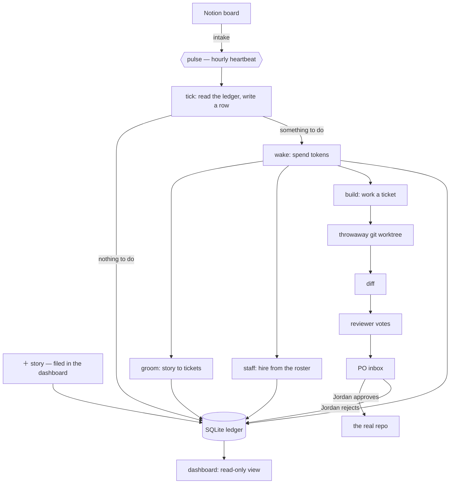

# Colony Dash

An autonomous agent colony that runs a scrum board against a directory of real
projects — and a dashboard to watch it spend your money.

A heartbeat wakes once an hour, reads the board, breaks stories into tickets,
hires specialist agents to work them, spends a bounded token budget, and
escalates only what genuinely needs a human. Every fact about execution lives in
a SQLite ledger rather than in a context window, so the loop is resumable, the
dashboard is a plain read view, and a crashed agent costs you a run instead of a
week.

The interesting problem here is not "can an LLM write code." It is: **what does
it take to leave one running unattended and still trust the repo in the
morning?** Most of this codebase is the answer to that question.


*One window. Spend across the top, what needs a human under it, the board in the
middle, the colony down the left, the levers on the right.*

**Contents** &mdash; [How it works](#how-it-works) &middot;
[The dashboard, panel by panel](#the-dashboard-panel-by-panel) &middot;
[Where the agents come from](#where-the-agents-come-from) &middot;
[The ledger](#the-ledger-is-the-system) &middot;
[The safety model](#the-safety-model) &middot;
[Budget](#budget) &middot; [Running it](#running-it) &middot;
[From a phone](#from-a-phone) &middot;
[How safe is this, honestly](#how-safe-is-this-honestly)

---

## How it works



Two things in that diagram carry most of the weight.

**The pulse writes a row even when nothing happened.** A "clean" tick is data. A
silent cron job is indistinguishable from a broken one, so a gap in the `pulses`
table is itself the alarm.


*`clean` is a real result, and `clean x13` is thirteen hours of nothing that were
each checked. `forced` is a beat someone asked for by hand; it does not move the
scheduled one. A wake carries the tokens it cost.*

**Nothing reaches a real repo without a human.** Agents write into a throwaway
git worktree. The diff goes to the PO inbox with a recommendation and a cost.
The loop never merges its own work and never approves its own output.


*The inbox is five slots wide and usually mostly empty, which is the point &mdash;
a card here has already been triaged as something no agent may decide. The empty
slots are not padding; they are the ceiling on how much can be waiting for you
before dispatch stops adding to it.*

Work arrives through two doors. Notion is the one with a workflow around it —
someone else's board, synced on every pulse. The dashboard's **＋ story** button
is the one for the thought you had at 11pm, and it writes to the ledger
directly. Neither is required; a colony with no Notion credentials configured
still has a full board.

## The dashboard, panel by panel

### The board


Seven lanes, and the counts are the whole summary. `needs info` and `needs
criteria` are lanes rather than error states, because "the colony does not know
enough to start" is a normal condition that should be visible rather than
retried.

**Filed** is separated below the line and labelled *nothing is being asked about
these*. A story that is done, shelved or never started is still worth having on
the board &mdash; but mixed in with live work it reads as a backlog, and a
backlog you have stopped believing is worse than a short one.

### Completed


Every delivery, newest first, with what changed in one sentence and what it cost.
The counts under each &mdash; `5 criteria met`, `1 skipped`, `2 blockers` &mdash;
are the honest version: a dispatch that met most of its criteria and hit two
blockers is reported that way rather than as a green tick. `NO CHANGES` is its
own outcome, because a run that correctly decided there was nothing to do is not
a failure and should not be filed as one.

### Ordis, and the colony

 

Left: the heartbeat. Beats, wakes, tokens spent, and how long until the next one
&mdash; plus the last beat's verdict in quotes, which is `"clean"` far more often
than not. Right: who is actually employed. Each agent shows its model, whether
its contract is read-only or write-capable, and how many runs it has done.
`RETIRE` ends a contract; the two structural agents do not have the button,
because a colony with no investigator and no reviewer is not a colony.

### Replying to a story


A story is a thread, not a form. Ordis asks, you answer in your own words, and
the reply is read on the next pulse rather than spending a token now &mdash; the
footer says so. `LEARNED` entries are what the colony took from the exchange and
kept, shown with the exact sentence it stored, because a system that claims to
learn should be willing to show its notes. A red `BLOCKED` band sits in the
timeline at the point it happened rather than at the top, so you can see what was
already understood before the question came up.

### Files


What has moved on disk since a given commit, across every project the colony can
read, ranked by how much. This is the colony's read scope made visible: the
answer to "what has been happening around here" that does not require asking an
agent. The tree below it is a plain browser with a filter.

### Spend


Tokens over time, by hour, day, week, month or year, and then the same total
broken out per agent. Cache reads are shown separately (`8.8M incl. cache
reads`) because otherwise an agent looks ten times more expensive than it is, and
the number you would then act on is the wrong one.

### Macros


The levers, in the order you would reach for them. `HALT` is first, is red, and
says exactly what it cannot do: it stops new dispatch and it cannot claw back a
run already in flight. `PULSE NOW` runs one extra beat and explicitly leaves the
schedule alone. `TICK ONLY` is the free one. The allowance is moved in signed
percentage points rather than set blind.

**Your last decisions** at the bottom is a short log of what *you* did, which
exists because the most common question after a week away is not what the colony
did but what you told it.

### The forge


The forge watches finished work for repeatable procedure. When the PO keeps
correcting the same thing by hand &mdash; nine times naming the project folder,
ten times deferring the same kind of escalation &mdash; that is not the PO being
diligent, it is the colony being wrong in a way a written procedure could get
right the first time. A candidate can be drafted into a skill; an `ACTIVE` one
carries its own evidence (`8 run(s) - 8/8 won - 25.2k tok saved`) and can be
retired the moment it stops paying.

### Themes


Twenty-odd of them, grouped. Purely cosmetic and entirely unjustifiable, except
that this is a window someone looks at every day.

<details>
<summary>The whole page, top to bottom</summary>


</details>

## Where the agents come from

Colony Dash does not invent its colonists. It **hires** them from persona files
on disk, then writes the employment contract itself.

Two folders are scanned, and **neither ships with this repository**:

| Folder | What it is |
| --- | --- |
| `~/.agency-agents` | an optional clone of a persona library, e.g. [msitarzewski/agency-agents](https://github.com/msitarzewski/agency-agents) |
| `~/.colony-agents` | personas you add yourself |

Both are optional. A fresh clone with neither has an empty Standby panel and
everything else works.


*270 personas here, grouped by department, `2 hired / 58` in Engineering. This is
a hiring pool rather than a roster: nothing in it costs anything or has any
authority until a contract is written for it.*

The split is deliberate and it is the whole design. The first folder is somebody
else's **git clone**, so nothing here ever writes to it — the next `git pull`
there would either clobber the file or refuse to fast-forward past it.
Everything the dashboard creates lands in the second, which upstream has never
heard of. A local persona shadows an agency one with the same
`division/filename`, which is the supported way to override one without touching
the clone.

Neither is committed here either. A persona library is a machine's furniture,
not this project's source, and shipping a stranger's agent library inside a repo
that merely reads it would be redistributing their work.

**Standby → `＋ persona`** opens a side panel with two ways in that converge on
one form: drop a `.md` file and its frontmatter fills the fields, or type them.
The division is a combo box — pick a department that already exists or type a
new one, and it becomes a folder. **`rescan`** beside it re-reads both folders,
for a file added in an editor or a clone that was just pulled.


*The panel says where the file is going and why, in the first sentence, because
"which of these two folders did that just write to" is the question this design
exists to answer.*

A persona file is a résumé and nothing more: `name`, `description`, `color`,
`emoji`, `vibe`. No `tools:`, no `model:`. The frontmatter written by that panel
is rebuilt from the fields rather than passed through, so a file arriving with a
`tools:` key loses it on the way in — a persona document claiming access it
does not have is one that eventually gets believed by a person. Everything that
actually governs an agent (write scope, tool allowlist, token ceiling, the three
gates) is written by the contract, not by the file. See ROSTER.md.

## The ledger is the system

There is no server to be down at 3am. One SQLite file under `.colony/` holds
sprints, stories, tickets, runs, pulses, token samples, escalations, skills, and
the roster. Agents read it and write to it; they do not remember. Schema changes
are append-only migrations verified by sha256 on every startup, so a checkout at
any commit can open a ledger from any earlier one.

The dashboard opens its own read-only connection. WAL mode is what lets it paint
while the pulse writes.

## The safety model

This is the part worth reading if you're only reading one.

Agents get a tool **denylist that cannot be overridden by their contract**
(`colony/agent.py:37`):

```python
ALWAYS_DENIED = ["Bash", "WebFetch", "WebSearch", "Task", "KillShell", "BashOutput"]
```

`Bash` is the load-bearing entry. `Edit` and `Write` are bounded — they touch
files inside a disposable worktree. `Bash` is unbounded: it is `git push`,
`rm -rf`, `curl | sh`. Denying the shell is what makes *"the colony cannot
push"* a statement about capability rather than a promise the agents are being
asked to keep.

Write tools unlock only when two independent things are true: the contract is
write-capable, **and** the caller has already opened a worktree for the run to
write into. The flag says "this run may write"; the `cwd` says where. No
contract on its own can produce both.

Read scope is the projects directory. Write scope is one project folder, named
by the active ticket, in a worktree, after approval. Never, at any tier: `.env`
or any credential file, `.git` internals, anything outside the projects root, or
`git push` / `commit --amend` / force-push / branch deletion.

### The one deliberate exception

`colony/console.py` runs `claude` with `--dangerously-skip-permissions`, no
allowlist and no worktree. That is not an oversight, and it is not the loop.

The whole design above is right for something that wakes up on its own at 3am.
It is exactly wrong for the case where a person is sitting in front of the
dashboard wanting to change the dashboard — every such change had to go out to a
separate terminal, and a program meant to run itself could not edit itself.

So the console is a second door, deliberately unlike the first:

- **It only opens when a person types.** There is no import path from
  `pulse.py` or `wake.py` into that module, and that is enforced by keeping the
  dependency one-directional. Nothing scheduled can reach it.
- **It is one conversation at a time.** A second send while a turn is in flight
  is refused rather than queued — two shells writing one tree is the exact
  failure this system exists to prevent.
- **It bills itself out loud.** Every turn's tokens and cost land in
  `console_turns`. Clearing the chat starts a new epoch instead of deleting
  rows, so the spend history survives the clear.

- **It only takes commands from the machine it runs on.** Reading the
  transcript works from anywhere the dashboard does. Sending does not.

That last one is the boundary that matters once the dashboard is on a phone.
Every other route here is a window onto a ledger, where a stolen access token is
worth reading the board and pressing approve. This one spawns a shell, so the
same token would be worth arbitrary code execution on the machine holding
`.env` — and that token crosses a home network over plain HTTP, in the first
URL and then in a cookie. Acceptable for a dashboard. Not for a shell.

So the console is scoped by **peer address** rather than by token, the same way
token rotation is, and for the same reason: some things should not be reachable
by something that can be copied.

The console panel has a switch for it — **answer from anywhere**, next to the
message box — and the switch is asymmetric on purpose:

| | from the desktop | from a phone |
|---|---|---|
| open the console to the network | yes, behind a confirm | no |
| close it again | yes | yes |

You may tighten from any device and loosen only from the machine itself. That
asymmetry is the entire reason this can be a button rather than a file edit: a
switch that a stolen access token could flip would not be a boundary. And the
direction that *is* open from anywhere is the one you want at the moment you
need it — away from the desk, having realised the phone in your pocket can open
a shell at home.

The switch writes `COLONY_CONSOLE_REMOTE` into `.env`, so the choice survives a
restart, and sets it live, so it does not need one. Editing that line by hand
still works and takes effect on the next start.


*The banner states what this is before you type in it, and the row above the box
states where it will answer from. On a phone that row carries an explanation and,
if the console is open to the network, the one button that closes it again.*

The other guards are the ones that were never about the agent: the server binds
`127.0.0.1` unless told otherwise, and every `/api/console/*` call needs the
`X-Colony` header like all other write routes.

Worth being exact about that header, because it is easy to read as more than it
is. It is CSRF protection — it proves a call came from the dashboard's own page
rather than from a link someone clicked. The *access* control was the loopback
bind. So the moment `--host` points anywhere else, the header is no longer
enough on its own, which is why serving off-machine is what arms the token gate
(`access.py`) rather than something you can forget to turn on.

## Budget

Tokens are the unit, dollars are grayed out beside them. A sprint gets an
allowance expressed as a percentage of the weekly window, the pulse samples
usage on the way past, and dispatch stops when the allowance is gone rather than
when the bill arrives. The two-tier pulse exists for the same reason: a tick is
free, a wake is not, and most hours only need a tick.

---

## Running it

Needs the `claude` CLI on your `PATH` and already authenticated. Developed and
run on Python 3.12.

```bash
git clone <this repo>
cd colony-dash
py -m pip install -r requirements.txt

cp .env.example .env      # optional — every key in it is optional
py -m colony init         # ledger, migrations, the two structural agents
py -m colony dash         # the dashboard window
```

`init` also scans `~/.agency-agents` for the persona roster if you have it
installed, and says "roster skipped" if you don't. The colony runs either way —
without a roster it just cannot hire beyond the two structural agents.

`colony dash --serve` skips the desktop window and just serves, if you'd rather
use a browser at `127.0.0.1:8787`.

The colony watches the folder **containing** this checkout, which assumes a
layout like:

```
projects/
  colony-dash/      <- this repo
  some-other-app/
  another-thing/
```

Point it somewhere else with `COLONY_PROJECTS_ROOT` in `.env` or the
environment.

### From a phone

The dashboard is responsive and installable — add it to a home screen and it
launches without browser chrome, in its own window, on its own icon. That is a
manifest and a service worker, not a second application: the phone renders the
same page against the same server against the same ledger, so there is no sync
step and nothing to reconcile. The service worker deliberately caches nothing
but an offline notice, because a cached board is yesterday's board displayed
with today's confidence.

Reaching it means serving on something other than loopback, which requires a
token — and that is one button. In the dashboard, open **file → phone** and
press *turn on*: it mints the token, writes it to `.env`, registers the logon
task, starts it, and shows you a QR code to point a camera at.


*The address, the token URL and the QR code are redacted in this screenshot. The
panel names the network it found and how good that is &mdash; `(lan)` says
plainly that the token is the only lock and that a tailnet would make it the
second.*

The same thing from a terminal, if you prefer:

```bash
py -m colony phone --on      # set it up and print the QR code
py -m colony phone           # where it is and whether it is answering
py -m colony phone --off     # stop serving at logon
```

There is one step the dashboard cannot take for you. Windows Firewall needs a
rule for the port, and writing one needs administrator rights, which a web
request is never getting. If the phone loads forever rather than showing an
error, this is why — a blocked packet is dropped, not refused, so the browser
waits instead of failing. Both the panel and the CLI say so when the rule is
missing, and `py -m colony phone --allow-firewall` writes it behind one UAC
prompt. It opens one port on private networks, not the program.

The trap worth knowing: a dashboard started from a terminal runs `python.exe`
and Windows offers to allow it the first time it binds. The logon task and the
desktop shortcut run `pythonw.exe`, which is a different file and therefore a
different rule — and a hidden task has no window to prompt in front of. So this
works when you test it from a terminal and fails on the machine you walk away
from.

Scanning the code opens `http://<address>:8787/?k=<token>` on the phone once.
The token is swapped for a 90-day cookie and stripped from the address bar,
because a token in a URL is a token in the browser history.

Turning it on never overwrites a `COLONY_ACCESS_TOKEN` that is already set, and
turning it off leaves the token alone — a phone that is paired stays paired.
The write to `.env` is an append and touches no existing line.

Changing the token on purpose is a separate button, *rotate token*, next to the
QR code. It writes a new value over the `COLONY_ACCESS_TOKEN=` line and leaves
every other byte of `.env` where it was, moving the file into place atomically
so a crash halfway through cannot take the Notion token with it. Every paired
phone is logged out; the desktop window is not, because a loopback caller is
trusted by address rather than by token. It is offered only on the machine
itself — rotating from a phone would log that phone out in the middle of its own
request — and the server enforces that as well as the panel. From a terminal it
is `py -m colony phone --rotate`.

Beside the on/off switch there is a **refresh**. That panel is a snapshot of
a machine rather than of the ledger — the address after a network change,
`serving` once the logon task finally binds, the firewall after a rule is
added in a terminal — and it is deliberately not on the live feed, because
asking Task Scheduler and PowerShell for all of that is too slow to poll. So
the one thing that goes stale here has a way to be asked again that is not
"close the drawer and open it".

`autostart` registers a hidden scheduled task — the same shape as the hourly
pulse, and beside it — so the server is already up when you pick up your phone.
That is the difference between a feature and a demo: the phone is the device you
use *because* you are not at the desk, and "first go to the desk and start it"
cancels the whole thing out. It binds `--host auto`, resolved at every launch
rather than written into the task once, because an address is a fact about the
network at boot and a task holding a stale one fails silently on the day it
changes. A tailnet address wins; a private LAN address is the fallback and says
so; anything else refuses.

| Command | What it does |
| --- | --- |
| `py -m colony phone --on` | the whole setup, and a QR code |
| `py -m colony phone --allow-firewall` | open the port, once, as administrator |
| `py -m colony phone --rotate` | a new token; every paired phone is logged out |
| `py -m colony autostart` | install it and start it now |
| `py -m colony autostart --show` | what is registered, and what is answering |
| `py -m colony autostart --remove` | stop it starting by itself; on-demand still works |

For one session instead of forever, `py -m colony dash --host auto --serve` is
the same bind without the task.

`--host` on a non-loopback address **refuses to start** without
`COLONY_ACCESS_TOKEN` set. That is not a nag: the dashboard is the whole ledger,
every run transcript, the project tree, and a button that spends money. Serve it
on a tailnet (Tailscale, WireGuard) rather than `0.0.0.0` and a forwarded router
port — the token is meant to be the second lock, not the only one.

This is remote access, not accounts. One operator, one ledger, one machine's
filesystem. See ARCHITECTURE.md §10.19 for why multi-tenancy is a different
program rather than a later feature.

### How safe is this, honestly

Without a tailnet, on a plain home LAN, ranked by what actually matters:

1. **The traffic is plain HTTP.** The access token rides in the first URL and
   then in a cookie, unencrypted, over your network. Anything already on that
   network — a guest, a smart TV, a compromised laptop — can read it off the
   wire. There is no defence here against an attacker who is already inside.
2. **The console is the reason that matters.** A leaked token would otherwise
   buy someone the board; the console would make it a shell. Which is why the
   console answers only from the machine itself (see *The one deliberate
   exception*), so the worst case is a dashboard rather than a command prompt.
3. **The token is in the first URL**, so it lands in browser history and in any
   proxy or router log that saw it. The cookie swap mitigates everything after
   that first request, not the request itself. `rotate token` exists for the day
   you find it somewhere you did not expect.
4. **There is no rate limit on `/login`.** Defensible against a 256-bit token
   — guessing is not a strategy — but worth knowing rather than assuming.

What is already right, so it does not have to be re-derived: the token is
`secrets.token_urlsafe(32)` and compared with `secrets.compare_digest`, so
neither guessing nor timing gets anywhere. The cookie is `HttpOnly` and
`SameSite=Lax` (not `Secure`, deliberately — a tailnet address is plain `http`
and `Secure` would loop the login forever). The firewall rule written by
`--allow-firewall` is scoped to **private and domain** networks, not public, so
joining coffee-shop Wi-Fi does not expose the port. The server binds one
specific LAN address rather than `0.0.0.0`. And `access.check` refuses to start
at all on a non-loopback host with no token, so there is no configuration in
which this serves openly by accident.

A tailnet (Tailscale, WireGuard) fixes 1 and 3 outright and is the recommended
answer. Everything above is what you get when you skip it.

### The rest of the CLI

| Command | What it does |
| --- | --- |
| `py -m colony status` | the dashboard, in text |
| `py -m colony pulse` | run one pulse now; `--no-wake` guarantees zero tokens |
| `py -m colony pulse --dry-run` | report what it would do, write nothing |
| `py -m colony halt` / `resume` | stop or restart all dispatch, colony-wide |
| `py -m colony allowance 10` | move this sprint's budget, signed percentage points |
| `py -m colony agents` | who is on the books and what they may touch |
| `py -m colony roster <query>` | search the hiring pool |
| `py -m colony roster --sync` | re-read both persona folders from disk |
| `py -m colony projects --diff X` | what has moved on disk |
| `py -m colony sql "SELECT ..."` | read the ledger directly |
| `py -m colony schedule` | install the hourly pulse as a hidden task |
| `py -m colony shortcut` | build the icon and a Desktop shortcut |
| `py -m colony mirror` | full refresh of the MySQL reporting mirror |

`halt` writes both a `.colony/HALT` file and a ledger row, on purpose: the one
control that must never fail open is the stop switch.

### Tests

```bash
py -m unittest discover -s tests -v
```

Standard-library `unittest`, no install step — a suite that needs a dependency
before it runs is a suite nobody clones and runs. 177 tests, under four seconds,
and they cover the things that are claims rather than code: migrations apply in
order and refuse to be edited afterwards, the tool denylist survives a contract
that asks for `Bash`, the write scope refuses everything outside one named
project folder, a story filed in the dashboard cannot name a folder that does
not exist, and the server cannot reach `uvicorn.run` on a network address with
no token configured, `--host auto` never resolves to a public address, and a
dashboard already serving on the network is not raised a second time on
loopback. The console's one-turn-at-a-time lock is in there too,
intercepted rather than spawned — nothing in the suite launches `claude`, and
nothing touches the real ledger.

### Platform

Developed and run on Windows 11. The core — ledger, pulse, agents, worktrees,
server — is portable, and the dashboard is a local web app. Two commands are
Windows-only by construction: `schedule` and `autostart` install hidden Task
Scheduler entries that run under `pythonw.exe` (a background heartbeat that pops
a console window once an hour is not a background heartbeat), and `shortcut`
writes a Desktop `.lnk`. On another OS, run the pulse from cron, the server from
a systemd user unit or a launch agent, and skip all three. `net.py` is portable;
it reads addresses, not the registry.

---

## Layout

```
colony/
  db.py           the ledger: connection, pragmas, sha256-verified migrations
  pulse.py        the heartbeat — tick, and when to escalate to a wake
  wake.py         the expensive half: groom, staff, reply, forge
  build.py        a build agent, worktree in and diff out
  agent.py        the one place an agent is spawned, and the tool denylist
  worktree.py     disposable checkouts
  control.py      halt, allowance, approvals, scope — the PO's levers
  server.py       FastAPI, loopback by default
  access.py       the gate that arms when the bind stops being loopback
  net.py          which address on this machine a phone can actually reach
  autostart.py    the server as a logon task, so the phone finds it already up
  phone.py        that whole setup as one switch, on the page and in the CLI
  firewall.py     the Windows rule without which none of the above arrives
  qr.py           a QR encoder, so the address is something you scan
  console.py      the PO's terminal (see: the deliberate exception)
  notion.py       intake
  roster.py       the hiring pool, scanned from an agency-agents install
  forge.py        mining finished work for repeatable procedure
  mirror.py       one-way SQLite -> MySQL, for reporting
  migrations/     append-only schema history
  ui/             index.html, app.css, app.js — no build step
                  manifest.webmanifest, sw.js, icons — installable on a phone
tests/            stdlib unittest, no install step
```

## Further reading

`ARCHITECTURE.md` is the real design document — the state model, the pulse
tick-by-tick, the budget rules, the execution model, section by section. Start
at §0 for the one-paragraph version.

`ROSTER.md` covers the hiring pool and why a persona alone is useless without
governance attached to it.

`PROJECT.md` is a working journal, not documentation. It is a dated log of what
was built and what broke, kept in the repo because the reasoning behind a
decision is worth more later than the decision is. Read it if you want the
archaeology; skip it otherwise.

## Status

Personal project, actively used, one operator. It is not a product: there is no
multi-tenancy, auth is a single shared token over a private network, and the
test suite covers the safety model rather than the whole surface. What it is
instead is a real
answer to the question at the top — a loop that has been left running against
live repos without eating one.
